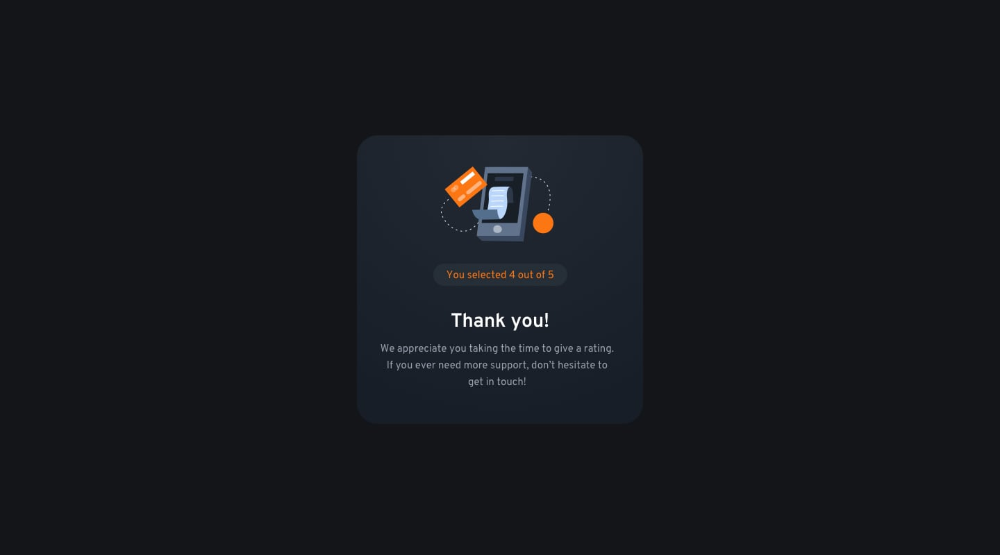

# Frontend Mentor - Interactive rating component solution

This is an Interactive rating component made with HTML CSS and Javascript where user can view the optimal layout for the app irrespective of their device's screen size and select and submit a number rating which can be used as a feedback receiver or evaluater. User will be greeted with a "Thank you" message after their feedback submission.

## Table of contents

- [Overview](#overview)
  - [The challenge](#the-challenge)
  - [Screenshot](#screenshot)
  - [Links](#links)
  - [Built with](#built-with)
  - [What I learned](#what-i-learned)
  - [Continued development](#continued-development)
  - [Useful resources](#useful-resources)
- [Author](#author)
- [Acknowledgments](#acknowledgments)


## Overview

### The challenge

Users should be able to:

- View the optimal layout for the app depending on their device's screen size
- See hover states for all interactive elements on the page
- Select and submit a number rating
- See the "Thank you" card state after submitting a rating

### Screenshot
#### At Desktop(rating-page):

#### At Desktop(thankyou-page):

#### At Mobile(rating-page):

#### At Mobile(thankyou-page):


### Links

- Live Site URL: [Click here](https://itsme-shivamkumar.github.io/interactive-rating-component/)


### Built with

- Semantic HTML5 markup
- CSS custom properties
- Flexbox
- Mobile-first workflow
- Javascript

### What I learned

I learned the basic mobile-first workflow and practiced the concept of flexbox for aligning the items and making it responsive. I also learned and practiced concepts of designing like color schemes, font-selection, any other... I loved using javascript, as a beginner, I am trying to write more and more javascipt code to learn and practice it. I learned the use of Spread Syntax (...) at some point of my javascript writing as seen below
```javascript
const stars=[...document.getElementsByClassName("rate")]
```
which I found really useful. And many other similar funtionalites of html, css and javascript I got to know. Looking forward to more such knowledge-acquiring and challenges in the future.


### Continued development

I would like to make this interactive rating card component as a template which can be easily integrated with anyone's code and they can get enjoy the funtionalities of it. Also, in future I am looking forward to add transition feature after the pressing of submit button.


### Useful resources

- [MDN Reference](https://developer.mozilla.org/en-US/docs/Web/CSS/Reference) - This helped me for many reasons. I really liked this website as at any point if I required to know the more functioning of the HTML or CSS tags or attributes, this website helped me.

## Author

- Github - [Vaishali Dewangan](https://github.com/vaishalidewangan786)
- LinkedIn - [@vaishali-dewangan-2060721a5](https://www.linkedin.com/in/vaishali-dewangan-2060721a5/)


## Acknowledgments

I would like to thank Frontend Mentor to give me such an amazing idea of creating this website as an challenge. I look forward to see more new and interesting challenges from them in future.